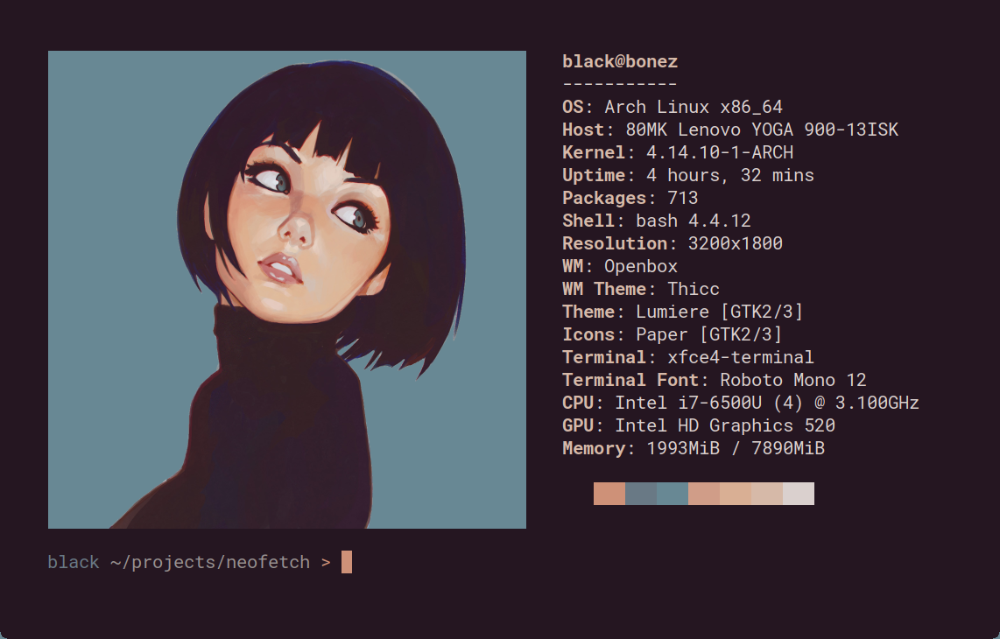
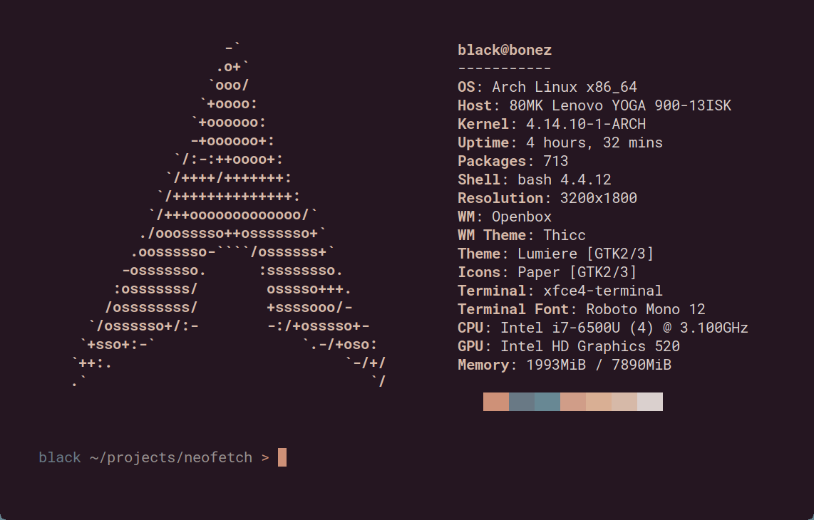

<h3 align="center">
    
</h3>

    Uma ferramenta de informações do sistema de console escrita em bash.

    
    
    

Neofetch é uma ferramenta de informações do sistema de console
escrita em `bash`. Neofetch exibe informações sobre seu sistema,
software e hardware de forma estética e visualmente agradável.

O objetivo geral do Neofetch é ser usado em capturas de tela do
seu sistema. O Neofetch mostra as informações que outras pessoas
desejam ver. Existem outras ferramentas disponíveis para
estatísticas/diagnósticos adequados do sistema.

As informações normalmente são exibidas ao lado do logotipo do
seu sistema. Você pode configurar ainda mais o Neofetch para
usar uma imagem, um arquivo ASCII personalizado, seu papel de
parede ou nada.

Você pode configurar ainda mais o Neofetch para exibir exatamente o que
deseja. Através do uso de sinalizadores de console e da página de
configuração, você pode alterar as saídas de informações existentes
ou adicionar suas próprias saídas personalizadas.

O Neofetch suporta quase 150 sistemas diferentes. Do Unix ao Windows, até
sistemas mais complexos como Minix, AIX e Haiku. Se o seu sistema favorito
não for suportado: abra uma falha e o suporte será adicionado.
